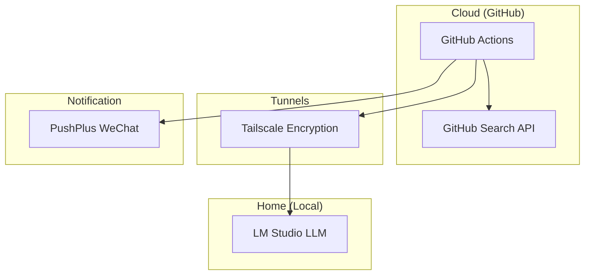

# GitHub Daily - 每日开源项目推送

> 每天北京时间 09:21 (错峰运行，减少延迟)自动搜索 GitHub 热门开源项目，使用本地 AI 生成精选总结，推送到微信群。

自动化每天搜索 GitHub 开源项目，使用本地 LM Studio 进行 AI 总结，通过 PushPlus 推送到微信群。

## ✨ 特性

- 🔍 **自定义搜索** - 灵活配置搜索主题，如 AI Agent、Local LLM 等
- 🤖 **本地 AI 总结** - 使用 LM Studio 运行本地大模型，数据安全
- 🌀 **流式生成** - 支持流式响应 (Streaming)，防止跨网络连接超时
- ⚡ **模型预热** - 自动预热加载模型，首字响应更迅速
- 🔒 **安全连接** - 通过 Tailscale 加密隧道访问家庭电脑
- 📱 **微信推送** - 支持 PushPlus 免费推送
- � **现代管理** - 使用 uv 处理依赖，极速环境搭建
- 🛠️ **调试工具集** - 内置全套 API 调试脚本，快速定位连接故障

## 🏗️ 架构图



## 文件结构

```shell
├── search_and_summarize.py    # 主脚本
├── pyproject.toml             # uv 项目配置文件
├── uv.lock                    # 依赖锁定文件
├── debug_*.py                 # 各类连接/API 调试脚本
├── .github/
│   └── workflows/
│       └── daily-interest.yml  # Actions 定时任务
└── README.md
```

## 准备工作

### 1. GitHub 配置

#### 1.1 创建 Personal Access Token (PAT)
1. 访问 GitHub Settings → Developer settings → Personal access tokens → Classic
2. 点击 "Generate new token (classic)"
3. 勾选 `repo` 权限
4. 复制生成的 token，保存好（只会显示一次）

#### 1.2 配置仓库 Secrets
在 GitHub 仓库的 Settings → Secrets and variables → Actions 中添加：

| Secret 名称 | 说明 | 示例 |
|------------|------|------|
| `REPO_TOKEN` | GitHub PAT | `ghp_xxxxxxxxxxxx` |
| `PUSHPLUS_TOKEN` | PushPlus token | 见下方获取步骤 |
| `PUSHPLUS_GROUP` | 微信群组编码（可选） | `xxxxx` |
| `TAILSCALE_AUTHKEY` | Tailscale 临时认证 key | `tskey-auth-xxxxx` |

#### 1.3 配置仓库 Variables (可选)
在 GitHub 仓库的 Settings → Secrets and variables → Actions → Variables 中添加：

| 变量名称 | 说明 | 示例 |
|------------|------|------|
| `LLM_HOSTNAME` | 家用电脑主机名 | `popos` |

### 2. 获取 PushPlus Token

1. 访问 https://www.pushplus.plus/
2. 微信扫码登录
3. 在"一对一推送"获取 token
4. 如果要发群聊：在"群组管理"创建群组，获取 group code

### 3. 配置 Tailscale

#### 3.1 安装 Tailscale（家用电脑）
1. 访问 https://tailscale.com/download 下载安装
2. 登录你的 Tailscale 账号
3. 在 admin 面板 (https://login.tailscale.com/admin) 启用 MagicDNS

#### 3.2 生成 Auth Key
1. 访问 https://login.tailscale.com/admin/settings/keys
2. Generate auth key → 勾选 Ephemeral → Generate
3. 复制 key，保存到 GitHub Secrets

#### 3.3 确认主机名
在 Tailscale admin 面板查看你的设备主机名。系统默认使用的是 `mbp`，你可以通过 GitHub Actions 变量 `LLM_HOSTNAME` 进行自定义覆盖，无需修改代码。

### 4. 配置本地 LM Studio

#### 4.1 安装 LM Studio
```bash
# Linux/macOS/Windows
# 访问 https://lmstudio.ai/download 下载安装包
```

#### 4.2 拉取模型
在 LM Studio 客户端中搜索并下载模型，如 `gemma-4-2b`

#### 4.3 启动服务（监听所有接口）
在 LM Studio 中：
1. 点击左上角 🤖 图标
2. 选择模型 `gemma-4-2b`
3. 点击 `Start Server` 按钮
4. 确保端口为 `1234`

## 本地测试

### 安装 uv (推荐)
本项目使用 [uv](https://github.com/astral-sh/uv) 管理依赖。

```bash
# 安装依赖并运行
uv run search_and_summarize.py
```

### 设置环境变量
```bash
export REPO_TOKEN="ghp_xxxxx"
export PUSHPLUS_TOKEN="your_token"
```

### 调试工具集 (Debug Toolkit)
本项目内置了多维度的调试脚本，用于在不同环境下快速排查 LM Studio 与网络连接问题：

| 脚本名称 | 用途 | 备注 |
|---------|------|------|
| `uv run debug_chat.py` | **推荐**：测试 Chat API | 验证 `/v1/chat/completions` 通信 |
| `uv run debug_speed.py` | 响应速度测试 | 测试 token 生成速度 (tokens/s) |
| `uv run debug_native.py` | 原生生成接口测试 | 验证 `/v1/chat/completions` 基础连通性 |


## 自定义搜索主题

编辑 `search_and_summarize.py` 中的 `QUERIES` 列表：

你可以根据需求修改 `QUERIES`。目前默认配置为搜索 GitHub 的 `topic:ai` 项目。

| 主题 | 搜索关键词 | 数量 |
|------|-----------|----------|
| **AI 热门项目** | `topic:ai` | 前 5 个 |

所有主题默认按 Star 降序排列。


### 🔧 添加自定义主题

```python
QUERIES = [
    {
        "q": 'topic:ai',
        "label": "AI 热门项目 Top 10",
        "max_items": 5
    },
]
```

### GitHub Search 语法速查

| 语法 | 说明 | 示例 |
|------|------|------|
| `created:>=YYYY-MM-DD` | 创建日期 | `created:>=2026-03-01` |
| `stars:>=N` / `stars>N` | Star 数量 | `stars:>=50` |
| `language:xxx` | 编程语言 | `language:rust` |
| `-is:fork` | 排除 fork | `-is:fork` |
| `-archived` | 排除归档 | `-archived` |
| `"..."` | 精确匹配 | `"machine learning"` |
| `OR` | 逻辑或 | `(A OR B)` |
| `in:name,description` | 搜索范围 | `in:README` |

## 故障排查

### LM Studio 连接失败
```bash
# 检查 Tailscale 连接
tailscale status

# 检查 LM Studio 服务
curl http://popos:1234/v1/models

# 检查防火墙
sudo ufw allow 1234/tcp  # Linux
```

### GitHub API 限流
- 未认证：每小时 10 次
- 已认证：每小时 5000 次
- 解决方案：确保配置了 `GITHUB_TOKEN`

### PushPlus 推送失败
- 检查 token 是否正确
- 检查群组编码（如果发群）
- 访问 PushPlus 官网查看推送日志

## 修改调度时间

编辑 `.github/workflows/daily-interest.yml`:

```yaml
on:
  schedule:
    - cron: '0 1 * * *'   # 改为其他时间
```

Cron 格式：`分 时 日 月 周`（UTC 时间）

常用时间：
- `0 1 * * *` - 每天 09:00（北京）
- `0 0 * * *` - 每天 08:00（北京）
- `0 */6 * * *` - 每 6 小时

## 成本说明

- GitHub Actions: 免费（每月 2000 分钟）
- Tailscale: 免费（支持 3 用户 + 100 设备）
- PushPlus: 免费
- LM Studio: 仅需家用电脑电费

## License

MIT
